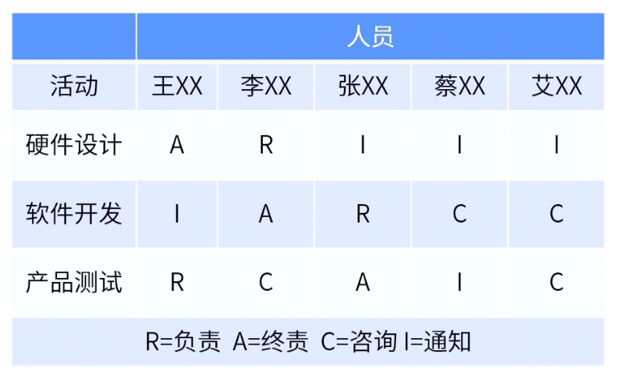

alias:: RACI

- RACI矩阵是一种展示分配给各个工作包中的项目资源的表格，用于显示执行、担责、咨询或知情，且与项目活动、决策和可交付物有关的干系人。
- > RACI矩阵是明确项目成员工作职责划分的最佳工具。
- {:height 362, :width 573}
- R：干活的
- A：拍板的
- C：大专家
- I：被通知的
- #Question
	- #card 下列哪一种图表示用来说明需要完成的工作与团队资源之间的关系？
	  A：资源直方图
	  B：组织图
	  C：控制图
	  D：RACI图
		- 正确答案：D
		  解析：活动与资源之间的关系，即责任分配矩阵，而RACI图是最典型的责任分配矩阵。