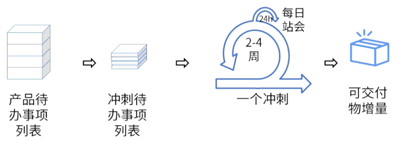
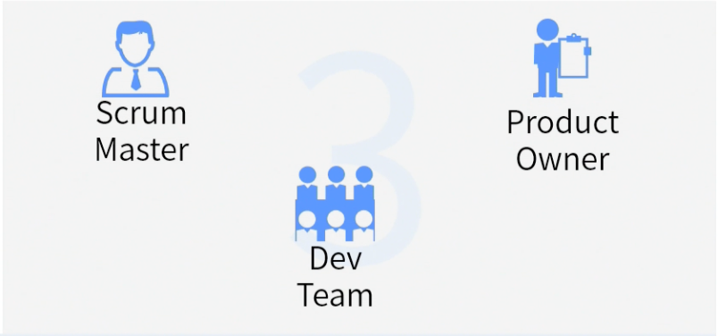
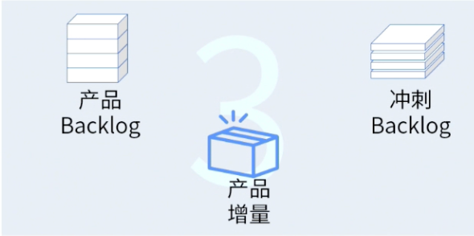
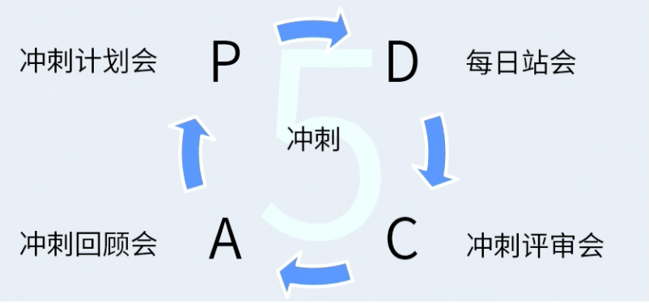
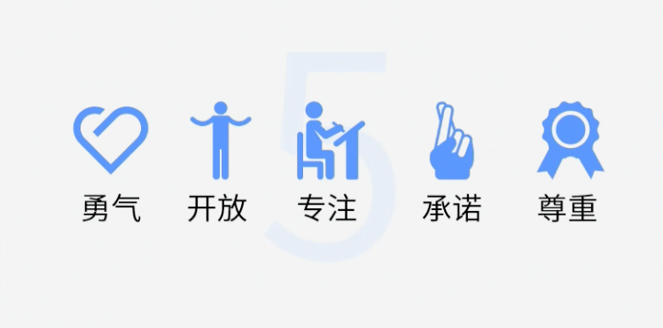

alias:: Scrum

-
- 
- # 3355
  id:: 684924e1-f7d3-4143-8408-31a7fcfa6b99
	- ## 三个角色
		- 
		- ### [[产品负责人]] Product Owner
		- ### [[Scrum教练]] Scrum Master
		- ### [[开发团队]] Dev Team
	- ## 三个工件
		- {:height 227, :width 440}
		- ### [[产品待办事项列表]] Product Backlog
		- ### [[冲刺待办事项列表]] Sprint Backlog
		- ### [[产品增量]] Product Increment
	- ## 五个会议（仪式）
		- > 敏捷的五个会议符合[[PDCA循环]]
		- 
		- 冲刺
		- [[冲刺计划会]]
			- ((684c008e-f69a-4841-9b27-7daf7eae4dc2))
		- [[每日站会]]
			- ((684c00b7-bdfd-49ce-ad74-a9b0eef930dc))
		- [[冲刺评审会]]
			- ((684c00c7-f014-44bb-978c-d771ba785cf7))
		- [[冲刺回顾会]]
			- ((684c00d8-cc61-407c-95eb-4b021e981c87))
	- 五种价值观
		- 