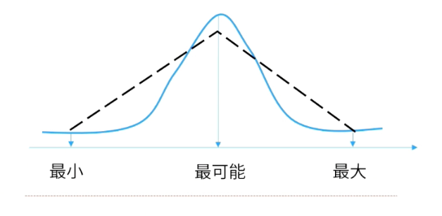

alias:: Three Point Estimate

- 通过考虑估算中的不确定性与风险，使用三种估算值来界定活动成本的近似区间，可以提高单点成本估算的准确性。这个概念起源于 [[计划评审技术]]（PERT）。
- **精准度：**不确定
- > 最快4周，最慢6周，最可能5周，平均算下来是 5周。
- # 三点估算的两种方法
	- 
	- ## 三角分布
		- ```calc
		  tE=(tO+tM+tP)/3
		  ```
	- ## 贝塔分布
		- ```calc
		  tE=(tO+4tM+tP)/6
		  ```
	- > tE： 期望时间
	  tO：最乐观时间
	  tP：最悲观时间
	  tM：最可能时间
	- > 项目经理对时间的估算有所疑惑，所以咨询专家，访谈专家后得出以下结果：
	  最乐观：2个月完成
	  最悲观：7个月完成
	  最可能：6个月完成
	  请问这个项目期望的完成时间是多少？
-