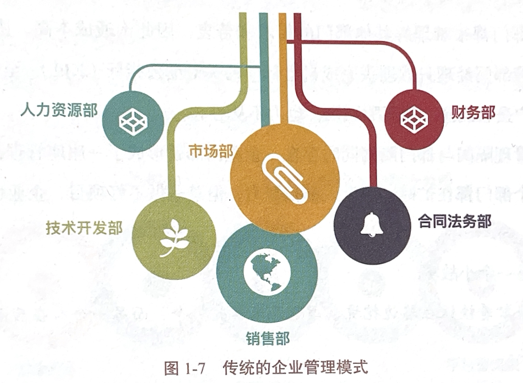
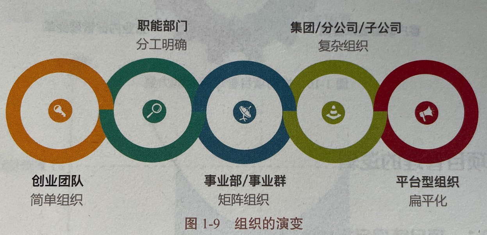

alias:: 组织管理模式

- ## 传统企业管理模式
	- 
	- **传统企业管理模式具有以下特点**
		- 以职能划分部门
		- 树形结构
		- 层级分明
		- 垂直管理模式
	- > 根据以上特点形成的企业管理模式会造成很多弊端
		- ### 管理隔阂
			- ((66482465-d2fd-4856-a921-b7bd675bc21d))
		- ### 部门隔阂
			- ((664824a7-3620-4f43-bea7-0df9183c1666))
		- ### 管理孤岛
			- ((6648252e-956b-41da-a1b7-cc613b0f8a34))
	- 在传统的管理模式中，这种组织架构属于职能型组织，也称“[[科层式组织]]”。
	- #Question
	  collapsed:: true
		- #card 在多项目的环境下采用职能型组织结构时，可能存在以下问题，除了：
		  The following problems can be found in the functional organizational structures in multiple projects environments, EXECPT：
		  A. 项目绩效与部门绩效难以统一 Project performance and department performance are difficult to be integrated
		  B.项目成员更在意他们的职能专业，而不是项目目标Project members are more concerned with their functional specialties than project goals；
		  C. 对客户需求的反应比较慢 Slower response to client's requirements
		  D.项目成员缺乏安全感和归属感 Lack of security and perception of affiliation to project members
			- 正确答案：D 
			  解析：
			  项目成员缺乏安全感和归属感是项目型组织的缺点。
- ## 企业转型方向
	- 企业转型的方向在哪里？有一些企业已经勇敢地进行了转型实践，那就是向平台型组织、扁平化的管理方式转型，如图1-9所示。
	- 
	- > 海尔把公司拆成了3000多家小公司，它们在海尔大平台上各自经营。
	  华为创始人任正非说：“现在企业的战争是以班长为单位的战争！”企业转型的核心就是**以项目为单元，灵活高效地组织资源，以客户为中心，交付价值。**
- ## 项目单元管理模式
	- 以项目为单元配置资源
	- 平台型组织，扁平化管理
	- 面向战略，交付价值
	- 关注成长、追求共赢
-