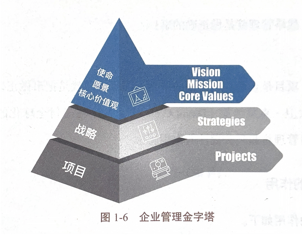

- 企业管理金字塔最上面一层是使命，愿景，核心价值观。
- 
- ## 使命
	- 使命即组织存在的理由，如组织的纲领、思想、目的、商业准则和公司信念。
	- > 例如星巴克的使命是激发并孕育人文精神，
	  阿里巴巴的使命是让世界没有难做的生意。
- ## 愿景
	- 卡恩称，“愿景是一种基于洞察力和远见的想象，他揭示了可能性和实践制约条件，描述了组织对期望的未来状态”。
	- > 亚马逊的愿景是成为全球最以客户为中心的公司，建立一个人们能够找到其想买的任何东西的在线商场。
- ## 核心价值观
	- 卡恩称，“核心价值观就是个人或组织在情感上选择坚守住的原则”
	- > “不作恶”就是谷歌的核心价值观，正是这句话感召了大量顶尖人才聚集谷歌，创造了一个又一个伟大的产品。当谷歌的AI技术被用于美国军方的项目时，遭到了4000多名员工的联名抵制。
	- #Question
	  collapsed:: true
		- #card 一位项目经理在一家以交付环保项目而闻名的公司工作。在项目半年审查期间，项目经理向项目发起人提出了关于项目可行性和成功的严重担忧。有些干系人因为项目可能导致土地侵蚀而反对该项目。项目经理应该做什么？A project manager works for a company that has a reputation of delivering environmentally sustainable projects. During the half- yearly review of the project, the project manager raises serious concerns with the project sponsor regarding the project's viability and success. There are some stakeholders who oppose this project on the grounds of compromising land erosion.What should the project manager do?
		  A.由于项目复杂性，向事业部经理请求额外资源。Request additional resources from the business unit manager due to the project's complexity.
		  B.计算项目的浮动时间，因为它严重影响了项目的关键路径。Calculate float on the project because it has severely affected the project's major critical path.
		  C.提议关闭项目，因为它不再符合组织的商业价值。Propose to close the project because it no Ionger fits the business values of the organization.
		  D.计算挣值(EV)，因为项目经理在年度审查中预测这个项目会亏损。Calculate earned value (EV) because the project manager is forecasting a loss for this project in the yearly review.
			- 正确答案： C
			  解析：
			  复杂场景题-注意解题思路。C选项最佳，公司以交付环保项目而闻名，现在项目遭遇到的反对主要是基于环境保护的考虑（土地侵蚀），其违反了公司的核心商业价值和使命，继续实施可能损害公司的声誉和商业目标，最合适的做法是向高层提出关闭项目的建议。
			  1
- ## 战略
	- 将企业愿景分解为阶段性的奋斗目标就是战略。
	- > 百时美施贵宝公司（BMS）发现，生物技术可能为癌症治疗创造机会，因此，BMS公司将技术能力从具有传统优势的有机化学转到生物技术上。
	- ### 战略管理
		- 战略管理是指管理者对企业或组织在一定时期的全局、长远的发展方向、目标、任务和政策，以及资源调配做出的决策和管理艺术。
		- 战略管理还包括公司在完成具体目标时对不确定因素做出的一系列判断，公司应审时度势，基于环境制定战略。简而言之，战略管理就是做正确的事。
- ## [[项目管理]]
	- 简单来说，项日是企业战略落地的单元，项目管理就是把事做正确！
	- > 美国学者大卫•克莱兰德（David Cleland）说：“在应付全球化的市场变动中，战略管理和项目管理将起到关键性的作用。”