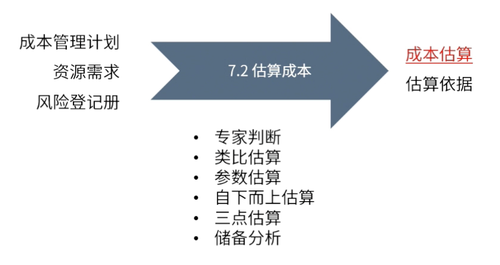

type:: ITTO
chapter:: 7.2

- 评估项目所需要的资源，评估项目的[[风险应对成本]]，基于此对项目中每项活动进行成本的量化评估。
- 
- # 输入
	- [[成本管理计划]]
	- [[资源需求]]
	- [[风险登记册]]
- # 工具与技术
	- [[专家判断]]
	- [[类比估算]]
	- [[参数估算]]
	- [[自上而下估算]]
	- [[三点估算]]
	- [[储备分析]]
- # 输出
	- [[成本估算]]
	- [[估算依据]]