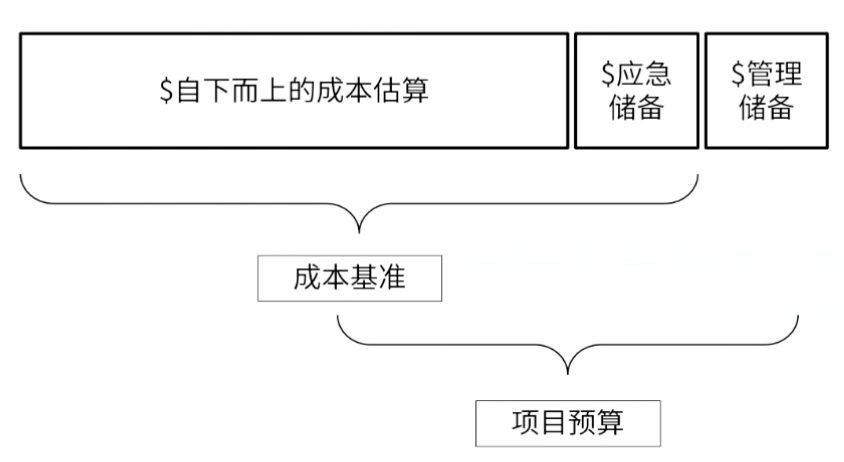

alias:: 储备分析技术

- 
- 储备分析用于确定项目所需的应急储备量和管理储备。
- 在进行持续时间估算时，需考虑应急储备，以应对进度方面的不确定性。
- ## 作用
	- 随着风险的跟踪，不断分析并调整储备。
	- 分析剩余储备能否应对风险
	- 应急储备，已知风险
	- 管理储备，未知风险
- know-type:: 场景
	- 随着风险变化，不断调整储备
	- 应急储备和管理储备的区别
	- 应急储备项目经理审批
	- 管理储备走正式的变更流程
- #Question
  collapsed:: true
	- #card 离完成分配的任务只剩30天时，一名项目团队成员离开公司。可惜的是，没有可用的替代资源。项目经理在项目进度计划中包含一个应急储备金。为了计算剩余的应急储备金，项目经理应该使用什么技术？
	   A：风险审计
	   B：趋势分析
	   C：储备分析
	   D：技术绩效衡量
		- 正确答案：C
		  解析：储备分析应对风险。
	- #card 离完成分配的任务只剩30天时，一名项目团队成员离开公司。可惜的是，没有可用的替代资源。项目经理在项目进度计划中包含一个应急储备金。为了计算剩余的应急储备金，项目经理应该使用什么技术？
	  A：风险审计
	  B：趋势分析
	  C：储备分析
	  D：技术绩效衡量
		- 正确答案：C
		  解析：储备分析应对风险。