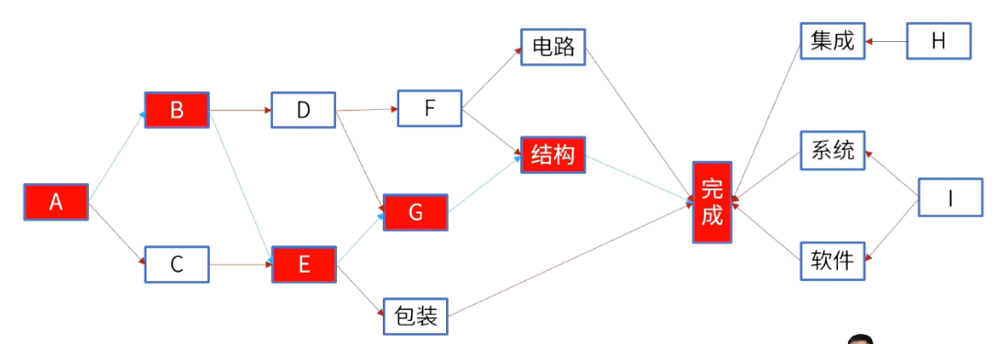

alias:: 关键链法,CPM,要径法

- #重点
- 关键路径法用于在进度模型中估算项目**最短工期**，确定逻辑网络路径的**进度灵活性大小**。
	- 
- ## 要点
	- 最长的路径为项目的关键路径
	- 关键路径是项目能够完成的最短工期
	- 关键路径上的所有活动是刚性的，没有灵活空间
	- 非关键路径上的活动可以适当延期
	- 关键路径上活动的浮动时间一般为零
- #Question
	- #card 一名项目团队成员报告说因为和她配合的技术人员离职了，需要重新招募替代人员，因此活动原定的开始时间需要顺延2周。因为项目对公司非常重要， 这个突发情况导致管理层很紧张。你作为项目经理在汇报项目进展时却坚持说项目可以按期完成。请问依据是？ {{cloze B}}
	  A. 活动处于关键路径上，你会重点关注
	  B. 活动处于非关键路径上，且总浮动时间大于2周
	  C. 活动处于非关键路径上，无论如何不会影响总工期
	  D. 活动处于关键路径上，团队可以加班赶回来
	- #card 一家公司希望启动一个新的产品线。项目经理确定了下列活动。由于原材料短缺，活动D延期。在不造成项目延期的前提下，项目经理可以接受活动D延期多少天？
	  A：20天
	  B：10天
	  C：15天
	  D：0天
		- 正确答案：B
		  解析：A—B—E为关键路径，共75天，A—C—D—E为非关键路径，共65天，D在非关键路径上，浮动时间为10天，即最多可以延期10天。