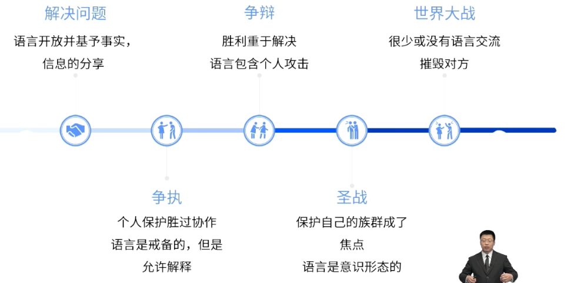
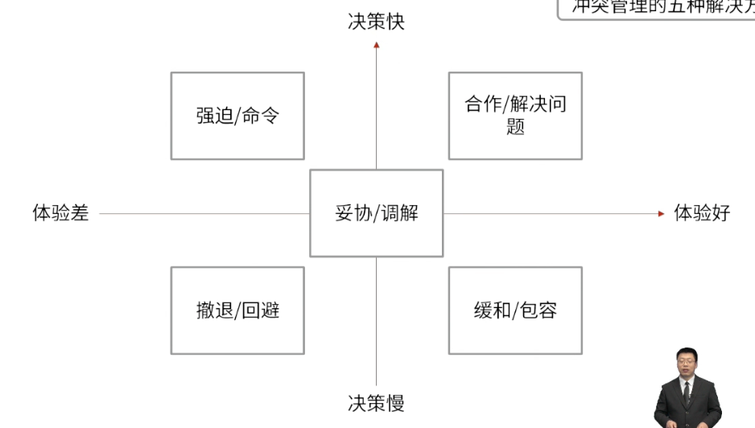

- #重点 #NoAsk
- 在项目环境中，冲突不可避免。项目经理要善于处理冲突。
	- 冲突不是坏事
	- 冲突是阶段的
	- 解決冲突也是分步骤的
- ## 冲突的来源
	- 资源稀缺
	- 进度优先级
	- 意见分歧
- > 成功的冲突管理可提高生产力，改进工作关系。同时，如果管理得当，意见分歧有利于提高创造力和改进决策。
- ## 冲突管理的三个阶段
	- 
	- 假如意见分歧成为负面因素，应该首先由项目团队成员负责解决； - 自行解决
	- 如果冲突升级， 项目经理应提供协助，促成满意的解决方案，采用直接和合作的方式，尽早并且通常在私下处理冲突。 - **私下解决**
		- #Question
		  collapsed:: true
			- #card 作为Scrum主管，你正在领导有关用户故事的相对规模估算练习，有两位开发人员开始就应该分配给特定用户故事的点数而争吵不休。在升级为争执前，你把两位开发人员分开。考虑到不是第一次发生这样的事件，你应该尝试做些什么来解决冲突？
			  collapsed:: true
			  A：取消会议，然后与开发人员会面
			  B：平均两个团队成员提供的故事点估算值
			  C：允许开发人员自行解决问题
			  D：使用理想时间估算方法而不是故事点
				- 正确答案：A
				  解析：如果冲突进一步加剧，项目经理要介入并私下处理冲突。
	- 如果破坏性冲突继续存在，则可使用**正式程序**，包括采取惩戒措施。 - 正式程序
	- 项目经理与团队定期举行虚拟会议。在执行阶段，项目经理注意到两名特定团队成员经常争辩和发生分歧，这导致会议超时并让团队其他成员分心。项目经理应该做什么？ {{cloze D}} #card
		- A.与团队成员讨论问题，如果继续存在该行为，则寻求管理层的决议
		- B. 告知这些团队成员他们的行为违反了团队章程，并将他们从团队中开除
		- C. 要求这些团队成员的职能经理解決这种行为
		- D.认识到这是震荡阶段的一部分，并安排团队建设活动
- 
- ## 冲突管理的五种解决方法
	- 
	- | 优先级 | 解决方法 | 适用场景 | 造成结果 | 举例 |
	  | ---- | ---- | ---- |
	  | 1 | 合作 / 解决问题 | 适用大多数场景，也推荐，首选 | 双赢 | 团队成员因为是否使用某软件产生冲突，项目经理召集两人面对面沟通解决。 |
	  | 2 | 妥协 / 调解 | 适用不太固执的双方，**各让一步** | 双赢或双输 | 项目经理要求两个团队成员各让一步，解决当前的项目困难 |
	  | 3 | 缓和 / 包容 | **求同存异** | 冲突依然在 | 项目经理要求成员只关注一致的地方，暂时搁置意见不同的地方 |
	  | 4 | 撤退 / 回避 | 对目标影响很小或不想解决 | 未解决问题 | 项目经理说：我现在不能处理这个问题 |
	  | 5 | 强迫 / 命令 | 紧急情况下二选一 | 输赢 | 发起人和项目团队成员对某事件冲突，时间紧急，项目经理研究后决定采取其中一个成员的方案。 |
		- > 考试中当没有明确说明解决关键词，可以按照表中的优先级进行选择
	- #Question
		- #card 在与干系人的项目计划介绍会议上，针对一个问题进行了讨论，并达成了一项协议，各方都持相同意见。然而，过了一段时间后，项目经理又从一个主要利益干系人那里收到一封电子邮件说他们改变主意了。他们对这个问题的看法有所改变，希望各方能够一起重新讨论新的方法和选择。项目经理应首先尝试哪种解决冲突的方法呢？
		   A：妥协
		   B：强迫
		   C：缓解
		   D：撤退
			- 正确答案：A
			  解析：题干问题首先尝试哪种方法，按照优先级首先应该选择妥协的方法。
		- #card 项目经理发现一个不可预料的高影响风险已经成为项目的一个因素，团队成员之间的自身利益导致问题得不到解决，项目经理**必须快速行动**，让团队重新集中精力，以便项目恢复进度，项目经理应该使用下列哪一项技术来解决问题？
		  id:: 68407626-46aa-4e4f-b4f7-42146ce04805
		   A：妥协
		   B：合作
		   C：强迫
		   D：包容
			- 正确答案：C
			  解析：项目经理必须快速行动，紧急情况下选择强迫。