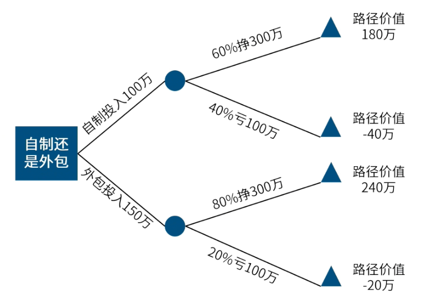

- EMV（预期货币价值）分析
- 用[[蒙特卡洛分析]]后，花100万，项目成功的概率是60%收入 300万，失败的概率是40%损失100万。问EMV=？
- > EMV1=（300X 60%） +（-100× 40%）-100=40万元
- 如果外包项目，花150万，项目成功概率是80%收入300万， 20%概率损失100万，请问是选择自制还是外包？
- > EMV2=（300X 80%）+（-100× 20%）-150=70万元
- 
- #Question
	- #card 项目经理针对项目可能会遇到的二个情景完成了蒙特卡洛分析。其中一个情景的结果是有60%的可能性会花费100万美元。另一个情景的结果是有40%的可能性会花费200万美元，这是用了什么方法？
	  id:: 68407409-b813-4b65-be48-1aa5f196b5ae
	   A：[[德尔菲法]]
	   B：[[决策树分析]]
	   C：[[定量风险分析]]
	   D：[[定性风险分析]]
		- 正确答案：B 
		  解析：两条路径的决策分析，使用决策树分析的工具。