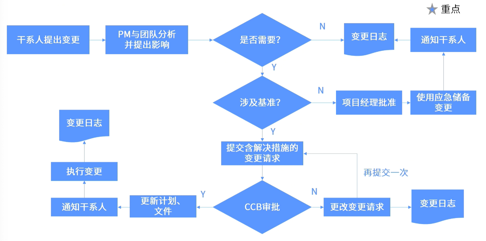

- 整体变更控制流程，由干系人提出变更，到变更被实施完成后的所有流程。
-  #重点
- 变更提出后，团队要分析整体的影响
  logseq.order-list-type:: number
- 基准未形成或不涉及基准的变更，由项目经理审批即可
  logseq.order-list-type:: number
- 一旦涉及到基准，则需要将含解決措施的变更请求提交给CCB
  logseq.order-list-type:: number
- 变更一旦获得批准，则需要先更新项目管理计划和项目文件
  logseq.order-list-type:: number
- 变更执行以前，一定要通知干系人
  logseq.order-list-type:: number
- #Question
	- #card 在项目过程中，项目经理得知一位关键干系人被替换了。虽然新的干系人表达了对项目范围的理解，但他们仍想坚持几项新的需求，而这将影响项目的成本和进度计划。项目经理下一步应该做什么？
	  During the project, the project manager learned that a key stakeholder was replaced. Although the new stakeholders expressed their understanding of the scope of the project, they still wanted to adhere to several new requirements, which would affect the project's cost and schedule.What should the project manager do next?
	  A：请求干系人经理支持保持当前的需求 Ask the relevant party manager for support to maintain current needs
	  B：通知项目发起人将发生的延迟情况以及将增加的费用 Notify the project sponsor of the delays that will occur and the costs that will increase
	  C：要求之前的干系人与新的干系人讨论此事 Ask previous parties to discuss the matter with new parties
	  D：与新的干系人一起评估项目延迟和成本影响的细节 Evaluate details of project delays and cost impacts with new stakeholders
		- 正确答案：D
		  解析：变更流程：变更提出后，先分析影响，再提交含解决措施的变更请求给CCB。另外注意变更过程要与干系人充分沟通。