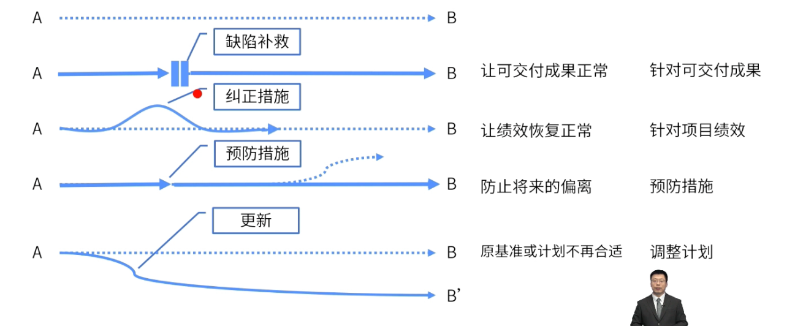

# 四个措施
	- 
	- ## 缺陷补救
		- > 为修正不一致产品或产品组件的有目的的活动。
		- ### 含义
			- 修复可交付成果物
		- ### 对应领域
			- 质量、范围
		- ### 案例
			- 验收不通过、质量有问题、文件弄错了
	- ## 纠正措施
		- 为使项目工作绩效重新与项目管理计划一致， 而进行的有目的的活动。
		- ### 含义
			- 回到正常轨道
		- ### 对应领域
			- 进度、成本、其他绩效领域
		- ### 案例
			- [[赶工]]、[[快速跟进]]等
	- ## 预防措施
		- 为确保项目工作的未来绩效符合项目管理计划而进行的有目的的活动。
		- ### 含义
			- 预防将来的偏离
		- ### 对应领域
			- 风险
		- ### 案例
			- 风险应对措施
	- ## 更新
		- 对正式受控的项目文件或计划等进行变更，以反映修改或增加的意见或内容
		- ### 含义
			- 更改计划、基准
		- ### 对应领域
			- 基准、计划
		- ### 案例
			- 基准的影响
- #Question
	- #card 在项目执行阶段，有关部门批准了一项监管法律，并责令项目团队立即遵守。这项法律将影响项目的[[范围]]、[[进度]]和[[成本]]，项目经理首先应该做什么？
	  collapsed:: true
	  A：减轻风险
	  B：修改[[项目范围]]
	  C：将问题升级，并上报给高级管理层
	  D：开始[[变更请求]]过程
		- 正确答案：D
		  解析：凡变更，必流程。
	- #card 在项目的最后一星期，一场飓风影响了项目的交付日期，项目经理应该怎么做？
	  collapsed:: true
	  A：使用[[储备分析技术]]
	  B：更新[[风险登记册]]
	  C：提交[[变更请求]]
	  D：将其报告给[[项目发起人]]
		- 正确答案：C
		  解析：已经影响交付日期了，说明影响了进度基准，需要先考虑变更。
	- #card 项目经理与客户开会，以协调一个大型项目。在会议期间，客户要求变更范围。项目经理首先应该做什么？
	  collapsed:: true
	  A：建议客户提交一份正式的变更请求
	  B：启动[[范围变更]]，以维护良好的客户关系
	  C：分析并评估这些变更的影响
	  D：拒绝这些变更，因为它们不包含在项目范围说明中
		- 正确答案：A
		  解析：客户要求变更范围，此时要和客户沟通，确认必须要变更时，需要客户提交正式的变更请求。
	- #card 项目受到一个未预料的风险的影响，迫使项目经理执行了一个[[权变措施]]，但是权变措施的作用有限。这一情况将影响需求的达成，项目经理应该怎么做？
	  collapsed:: true
	  A：将影响归档为[[质量偏差]]
	  B：将该案例转给专家来判断
	  C：提出变更请求
	  D：进行敏感性分析
		- 正确答案：C
		  解析：权变措施，需要走变更流程。