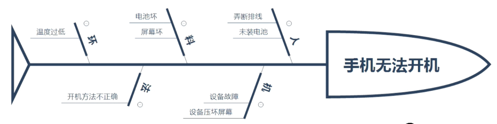

alias:: 石川图,鱼骨图,Why-Why分析图,Ishikawa diagram

- 石川图、鱼骨图、Why-Why分析图，将原因分解为离散的分支，识别[[根本原因]]
- 
- #Question
	- #card 项目经理审查风险登记册，并希望识别风险原因。应该使用下列哪一项分析和绘图技术？
	  A：故障树分析(FTA)和鱼骨图
	  B：计划评审技术(PERT)和因果分析
	  C：失效模式与影响分析(FMEA)和关键性分析
	  D：蒙特卡洛模拟和偏差分析
		- 正确答案：A
		  解析：鱼骨图用于分析原因。
	- #card 由于生产线存在错误和缺陷，制造商正面临大量产品退货，产品经理怀疑根本原因可能是培训和/或库存采购和货物分类流程较差，若要确定生产问题的准确的、根本原因，应使用下列哪一项工具？
	  A manufacturer is experiencing a large number of returned items due to production line errors and defects. The product manager suspects that the root causes may be training and/or poor inventory purchasing and sorting processes. Which to should be utilized to determine the precise root causes of the production problems?
	  A：帕累托图 Pareto chart
	  B：直方图 Histogram
	  C：质量控制图 Quality control chart
	  D：石川图 Ishikawa diagram
		- 正确答案：D
		  解析：过程组：实践指南 页码：P252 图10-2. 因果图，又称“鱼骨图”、“why-why分析图”和“石川图”，将问题陈述的原因分解为离散的分支，有助于识别问题的主要原因或根本原因。 寻找根本原因的，就选因果图、石川图、鱼骨图。