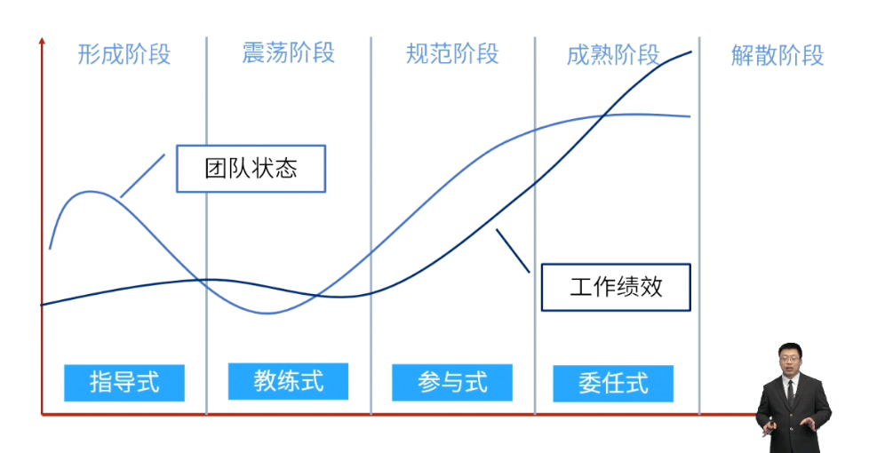

- #重点
- 
- | 阶段 | 冲突 | 信任 | 关键字 |
  | ---- | ---- | ---- |
  | 形成阶段 | 低 | 低 | 独立、自我、不引发冲突、组建 |
  | 震荡阶段 | 高 | 低 | 冲突、反对、争执 |
  | 规范阶段 | 高 | 建立信任 | 信任、开始建立、规范、喜欢互动 |
  | 成熟阶段 | 低 | 高 | 组织有序、相互协助 |
  | 解散阶段 | 低 | 高 | 结束 |
- #Question
  collapsed:: true
	- #card 敏捷项目进入第三次迭代。尽管团队坚持遵循敏捷最佳实践，但Scrum主管还是觉得团队状态存在问题。每个团队成员都独立工作，在Scrum活动中，团队成员之间不开放，避免冲突。团队目前在Tuckman开发模型的哪个阶段运行，Scrum主管可以做些什么来帮助团队进入下一个阶段？
	  A：震荡阶段；Scrum主管需要帮助团队在冲突中找到方向，实现高绩效
	  B：规范阶段；Scrum主管需要帮助团队将不健康和低效的冲突放在一边
	  C：成熟阶段；Scrum主管需要确保冲突得到缓解，以便让团队成员继续工作
	  D：形成阶段；Scrum主管需要帮助团队认识到冲突是具生产力且有必要的
		- 正确答案：D
		  解析：团队成员不开放，处于形成阶段。