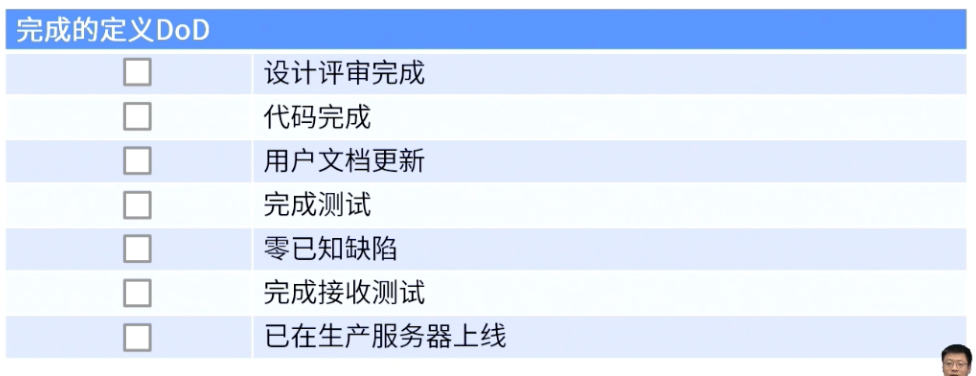

alias:: DoD

- 为了考虑可交付物能供客户使用，而必须达到的所有准则的检查清单
	- 
- #Question
	- #card 在冲刺计划会议上，Scrum主管重申，如果在冲刺结束时敏捷项目团队正在构建的产品增量没有达到冲刺开始时指定的标准，那么这项工作将不会包含在当前冲刺的速度中。Scrum主管指的是什么？
	  At the sprint planning meeting, the scrum master reiterates that if by the end of the sprint the product increment that the agile project team is building does not meet the criteria specified at the beginning of the sprint, this work will not be included in the velocity for the current sprint. What does the scrum master refer to?
	  A：完工尚需估算 Estimate to complete
	  B：完成的定义 Definition of done
	  C：项目退出标准 Project exit criteria
	  D：质量测量指标 Quality metrics
		- 正确答案：B
		  解析：敏捷实践指南 页码：P151 章节：术语表 完成的定义DoD ：它是团队需要满足的所有标准的核对单，只有可交付物满足该核对单才能视为准备就绪可供客户使用。 敏捷项目完成后，检查DoD，以验证是否满足标准