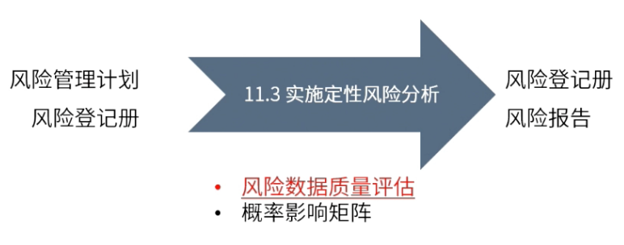

type:: ITTO
chapter:: 11.3

- 
- # 过程
	- ## 输入
		- [[风险管理计划]]
		- [[风险登记册]]
	- ## 工具与技术
		- [[风险数据质量评估]]
		- [[概率影响矩阵]]
	- ## 输出
		- [[风险登记册]]
			- 每项单个风险的概率和影响
			  logseq.order-list-type:: number
			- 风险的优先级
			  logseq.order-list-type:: number
			- 风险责任人
			  logseq.order-list-type:: number
			- 低风险的观察清单
			  logseq.order-list-type:: number
		- [[风险报告]]