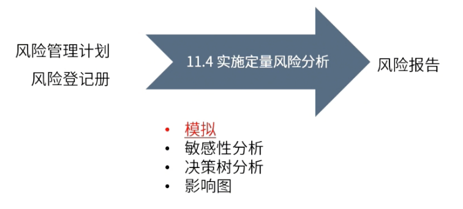
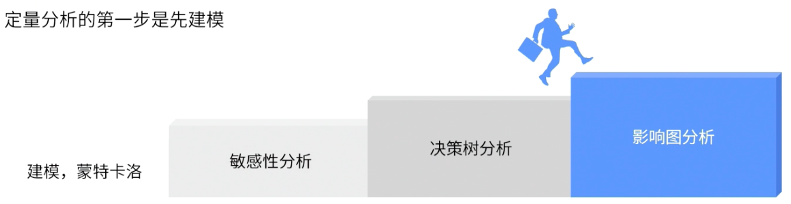

type:: ITTO
chapter:: 11.4

- 
- 将[[定性风险分析]]中的高优先级进行定量分析，以确定对项目的整体风险，并输出风险报告。
- # 过程
	- ## 输入
		- [[风险管理计划]]
		- [[风险登记册]]
	- ## 工具与技术
		- 
		- [[蒙特卡洛分析]]
		- [[敏感性分析]]
		- [[决策树分析]]
		- [[影响图]]
	- ## 输出
		- [[风险报告]]
			- 整体风险敞口
			  logseq.order-list-type:: number
			- S曲线
			  logseq.order-list-type:: number
			- 风险优先级
			  logseq.order-list-type:: number
			- 风险趋势
			  logseq.order-list-type:: number
			- 风险应对建议
			  logseq.order-list-type:: number