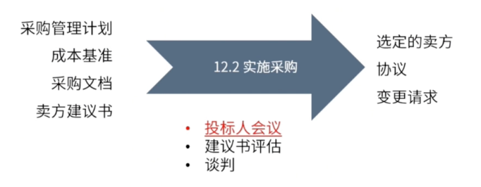

type:: ITTO
chapter:: 12.2

- 
- 发出采购需求，评估供方资质，开展招投标过程，确定选定的供应商， 经过谈判，达成协议签订合同。
- # 过程
	- ## 输入
		- [[采购管理计划]]
		- [[成本基准]]
		- [[采购文档]]
		- [[卖方建议书]]
	- ## 工具与技术
		- [[投标人会议]]
		- [[建议与评估]]
		- [[谈判]]
	- ## 输出
		- [[选定的卖方]]
		- [[协议]]
		- [[变更请求]]
- #Question
	- #card 在为一个价值1500万美元的项目进行招标的过程中，采购经理发现，有2家潜在的公司符合招标书的胜任要求。其中，A公司的费用较高，但比B公司拥有更多的专业知识。B公司符合项目的预算，但A公司不符合。采购经理正处于下列哪一个过程？
	  A：召开投标人会议
	  B：规划采购管理
	  C：实施采购
	  D：管理采购
		- 正确答案：C
		  解析：招标属于实施采购的过程。