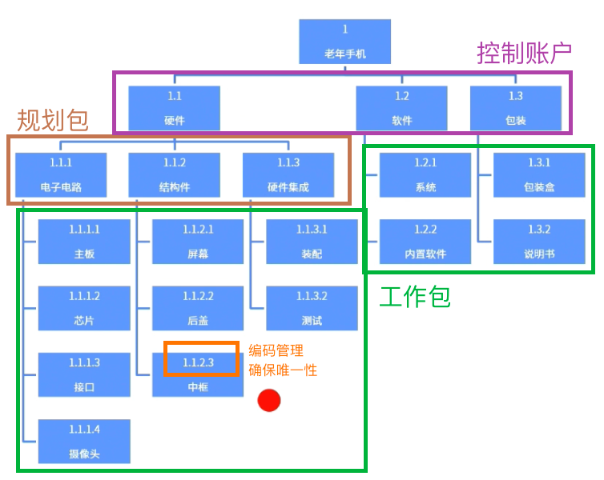

alias:: WBS,Work Breakdown Structure

- #重点
- WBS是**对项目团队为实现项目目标、创建所需交付成果而需要实施的全部工作范围的层级分解。**
- WBS组织并定义了项目的总范围，代表着经批准的当前项目范围说明书中所规定的工作。
- > 范围说明书中描述的可交付成果比较大，需要进一步分解为具体的工作包。
- 
	- 工作：名词，工作产品或可交付成果，努力的结果， 而非努力本身
	- 分解：划分成不同的类别， 分开成简单的事物
	- 结构：用确定的组织方式来安排事物。
- 
- # 管理原则
  know-type:: 场景
	- ## 100%原则
		- WBS包括项目范围所定义的所有工作内容以及可交付成果，包括内部的、 外部的、中间要完成的。
		- #Question
		  collapsed:: true
			- #card 进行自制或外购分折后，项目经理将已经包含工作分解结构(WBS）中的内容进行外包，项目经理应该采取下列哪一项措施？
			  A：将需要外包的可交付成果从WBS中移除
			  B：将需要外包的可交付成果保留在WBS中
			  C：创建另一个WBS，仅包含将需要外包的可交付成果
			  D：等到选定外包供应商后才对WBS进行更改
				- 正确答案：B
				  解析：WBS要包含100%原则，即使外包出去的可交付成果，也需要保留，只是无须进一步分解。
	- ## 滚动式规划
		- 当前无法分解的，需要远期才能完成的可交付成果，需要等待时机成熟后才能细化
	- ## 编码管理
		- 对WBS进行编码管理，以确保可交付成果的唯一性
- # 概念
	- ## 控制账户
		- 包含多个工作包的管理控制点。在该控制点上，把范围、预算、成本和进度进行整体的绩效管控。
	- ## 规划包
		- 工作内容已知，但是详细活动未知。
		- 处理控制账户以下、工作包以上的部分。
	-