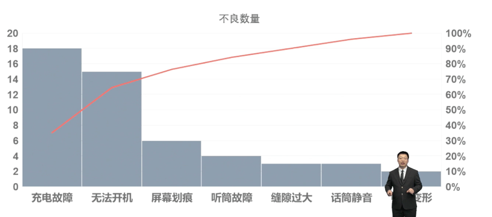

- 特殊的条形图，用于识别造成**大多数问题**的少数**重要原因**。80/20原则
- 可根据[[直方图]]排序而来
- 
- #Question
	- #card 项目团队发现造成产品缺陷的原因可以归纳为5种，而且每种原因导致的缺陷数量是不同的，以下哪个工具有助于帮助项目经理确定解决这些缺陷原因的优先顺序？ {{cloze A}}
	  A.帕累托图
	  B.鱼骨图
	  C. 直方图
	  D. 散点图
	- #card 项目经理希望确定产生项目中大多数问题或缺陷的原因。帮助确定问题领城，项目经理应该使用哪项工具？
	  A：控制图
	  B：流程图
	  C：帕累托图
	  D：散点图
		- 正确答案：C
		  解析：寻找大多数问题的原因，即满足80/20原则，选择帕累托图。