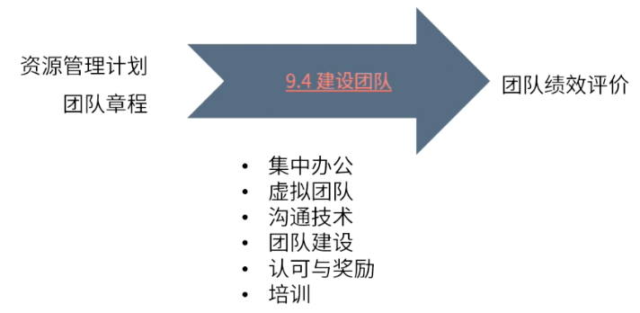
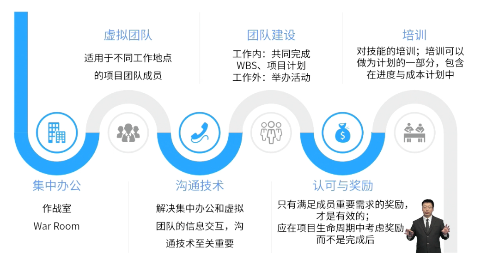

type:: ITTO
chapter:: 9.4

- 
- 通过一系列的建设团队的方法，让团队凝聚力提升，快速地从[[塔克曼阶梯理论]]的形成阶段进入到成熟阶段。
- # 输入
	- [[资源管理计划]]
	- [[团队章程]]
- # 工具与技术
	- 
	- [[集中办公]]
	- [[虚拟团队]]
	- [[沟通技术]]
	- [[团队建设]]
	- [[认可与奖励]]
	- [[培训]]
- # 输出
	- [[团队绩效评价]]