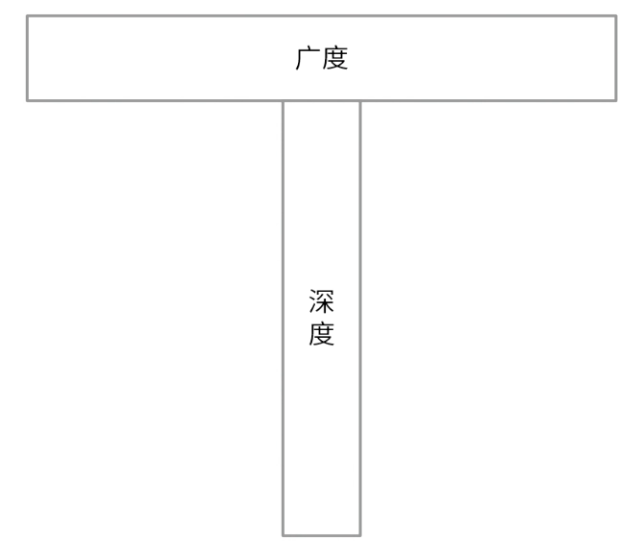
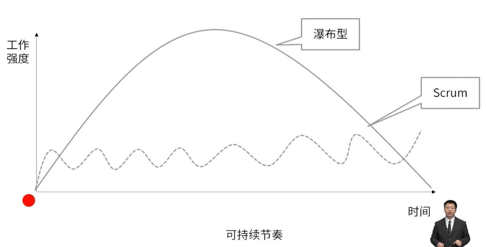

- **职责：**开发产品、梳理任务（冲刺待办）、回顾总结、召开站会
- **关键字：**通才型专家、自组织团队、让团队决策、跨职能团队
	- 3-9人的团队
	- 通才型专家
	- 团队成员都是全职工作
	- 团队自我组织和管理
	- 团队关系在一个冲刺中应该是固定的，个人的职能可以在新冲刺开始时发生调整。
- # 十大特征
	- ## 自组织
		- 团队拥有资源、自下而上的权力
	- ## 跨职能
		- 多样化、不同学科背景
	- ## T型技能
		- 让团队同时具备广度和深度
			- 
	- ## 责任共担
		- 每个人共同承担，共同负责
	- ## 广泛沟通
		- 首选面对面沟通， 减少沟通过滤
	- ## 透明沟通
		- 建立信任“最小惊讶原则”
	- ## 专注
		- 全职工作、专注于本项目
	- ## 可持续
		- 保持工作节奏、避免死亡行军
			- 
	- ## 稳定性
		- 保持团队稳定，避免震荡
	- ## 规模适中
		- 3~9人的规模