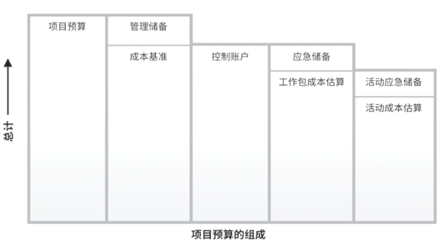

# 构成
	- 
	- POMBOK图例（复杂）
	  collapsed:: true
		- 
	- ### 应急储备与管理储备
		- [[应急储备]]用于已知风险
		- [[管理储备]]用于未知风险
		- > 若要使用管理储备，则需要走正式的变更流程，将管理储备纳入到基准中
	- > **项目经理可以使用管理储备吗？**
	  不管什么储备，都是为项目预留的，项目经理可以使用，需要正式的变更流程
		-
- # 估算精度
- ## 估算精度
	- 在项目过程中，应该随着更详细信息的呈现和假设条件的验证，对成本估算进行审查和优化。
- > 在项目生命周期中，项目估算的准确性将随着项目进展而逐步提高。
- ## 粗略量级估算
	- 在启动阶段可得出项目的[[粗略量级估算]] ，其区间为一25% 到 +75%；
- ## 确定性估算
	- 随着信息越来越详细，确定性估算的区间可缩小至 -5% 到+10%。
-