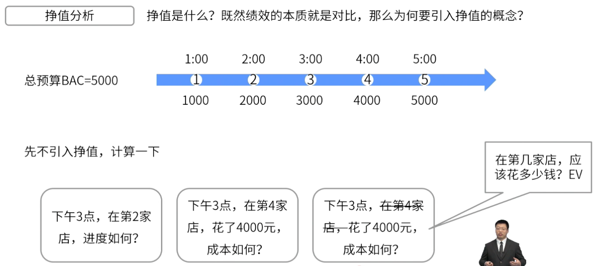

- 挣值分析对范围、进度和成本绩效进行了综合分析
	- 
		- > 挣值需要根据做了多少工作的前提下看花了多少钱，如果光看时间是没法判读是超支还是节约
- # 挣值的四个概念
	- [[完工预算]] - BAC
		- 总成本
	- [[计划价值]] - PV
		- 根据计划（时间）得出成本。
		- > 比如**下午两点**就应该在第二家店花2000
	- [[挣值]] - EV
		- 根据进度计算成本
		- > 比如**在第三家店**，就应该是下午3点花了3000
	- [[实际成本]] - AC
		- 实际花费
- #Question
	- #card 一个项目的总预算是60000元，在完成一半的项目任务时，项目经理发现，实际的项目成本已经达到了40000元。项目经理紧急采取措施来补充预算，才将项目重新拉回正常轨道，请问下列哪个选项是正确的？
	  A：当前项目的PV是30000元
	  B：当前项目的AC是30000元
	  C：当前项目的EV是30000元
	  D：当前项目的进度已经超期
		- 正确答案：C
		  解析：从题干中无法得出PV和进度是否超期的信息，根据项目任务完成了一半，能得出EV=60000*50%=30000元。AC=40000元，所以选项B是错误的。
	- #card 以下是为项目计算的，项目的状态如何？ 挣值(EV)=200000美元 计划价值(PV)=300000美元 实际成本(AC)=210000美元
	  A：进度落后，超过预算
	  B：提前进度，超出预算
	  C：进度落后，但不超过预算
	  D：接计划进行，但超出预算
		- 正确答案：A
		  解析：从选项能看出，EV小于PV和AC，因此进度落后，超出预算。