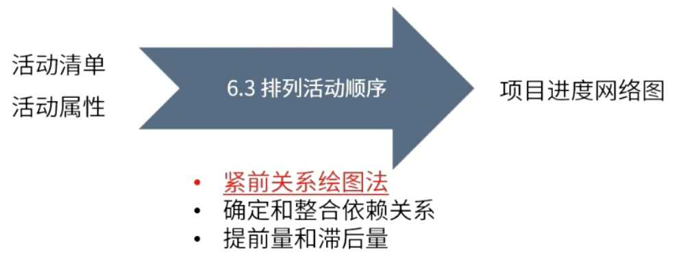

type:: ITTO
chapter:: 6.3

- 基于活动清单，梳理活动之间的逻辑关系，并输出项目进度网络图。
- 
- # 输入
	- [[活动清单]]
	- [[活动属性]]
- # 工具与技术
	- [[紧前关系绘图法]]
	- [[确定和整合依赖关系]]
	- ((68457264-a49b-4d83-ab4c-8f6937335f26))
- # 输出
	- [[项目进度网络图]]