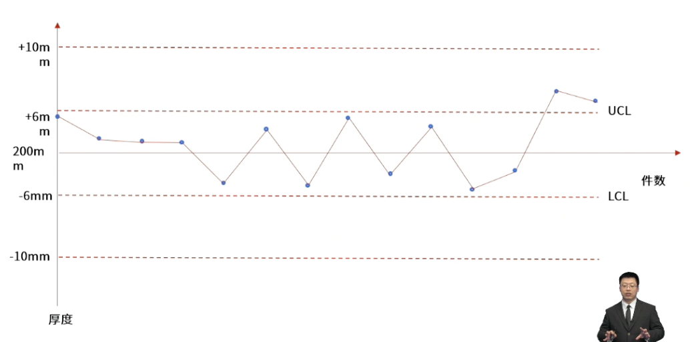

- 
- 控制图用于确定一个**过程是否稳定**，或者是否具有**可预测**的绩效。
- > 规格上下限一旦超过则出现不良。
  控制上下限一旦超过，则需要关注或分析。
- **控制图的管控方式：**
	- 一点在外原则：有一个点超出控制上下限， 则需要进行分析。
	- 七点连续原则：有七个点在平均值上方或下方，则需要进行分析。
	- 七个点连续上升或连续下降，也需要分析。
- #Question
	- #card 一个项目具有特定的服务水平协议，以保证对客户的服务质量。项目经理应使用什么样的工具，来确定该服务的稳定性以及可预测性？
	  collapsed:: true
	  A：控制图
	  B：帕累托图
	  C：流程图
	  D：标杆对照
		- 正确答案：A
		  解析：控制图能够实时监测品质数据，能够确定品质的稳定性，数据的趋势也能够体现可预测性。