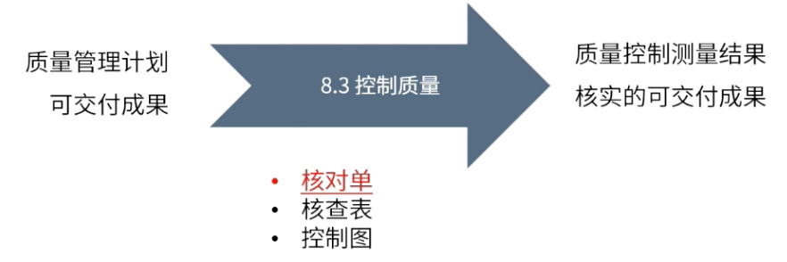

id:: 682c423e-ccc9-4e0b-a819-469ecc6a9dbb
type:: ITTO
chapter:: 8.3

- 
- 依据质量管理计划中的质量标准，对可交付成果进行检查与测试，最终输出核实的可交付成果。
- # 输入
	- [[质量管理计划]]
	- [[可交付成果]]
- # 工具与技术
	- [[核对单]]
	- [[核查表]]
	- [[控制图]]
- # 输出
	- [[质量控制测量结果]]
	- [[核实的可交付成果]]
- #Question
	- #card 在项目工作完成后，与客户一起召开会议交付四个项目成果。客户接受四个成果中的两个，并表明剩余两个产品不满足需求。交付产品之前，项目经理应该遵循哪个流程来确保与客户端期望保持一致？
	  id:: 68407983-6da2-4b54-96e8-35c3f0a61963
	   A：控制质量
	   B：管理质量
	   C：执行质量控制测量
	   D：执行质量审计
		- 正确答案：A
		  解析：题干中明确提到具体的两个产品不满足需求，属于控制质量。