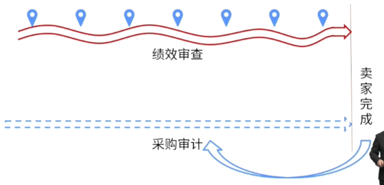

type:: ITTO
chapter:: 12.3

- 
-
- # 过程
	- ## 输入
		- [[进度基准]]
		- [[协议]]
		- [[采购文档]]
		- [[工作绩效数据]]
	- ## 工具与技术
		- [[索赔管理]]
		- [[绩效审查]]
		- [[采购审计]]
		- > 绩效审查与采购审计 #重点
		  
	- ## 输出
		- [[结束的采购]]
		- [[工作绩效信息]]
		- [[变更请求]]