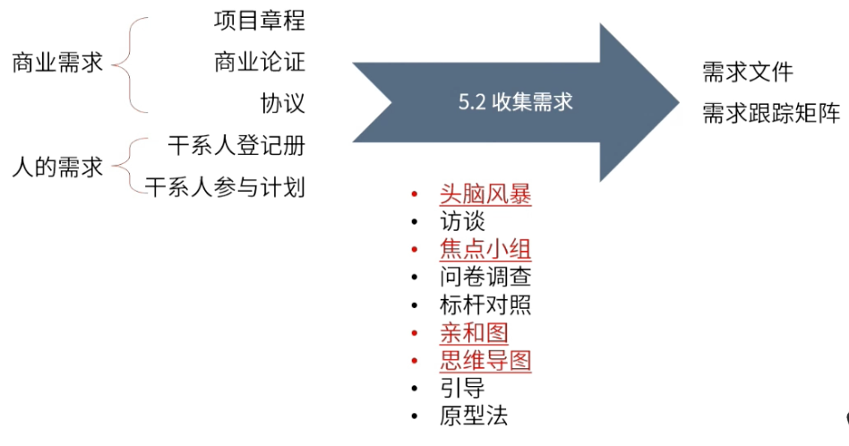
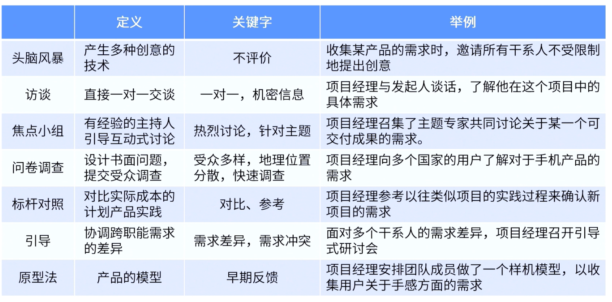

type:: ITTO
chapter:: 5.2

- 使用一系列的工具收集并明确商业需求与干系人的需求，最后生成需求文件与需求跟踪矩阵。明确的需求用于范围的定义。
- 
- # 输入
	- ## 商业需求
		- [[项目章程]]
		- [[商业论证]]
		- [[协议]]
	- ## 人的需求
		- [[干系人登记册]]
		- [[干系人参与计划]]
- # 工具与技术
	- 
	- [[头脑风暴]]
	- [[访谈]]
	- [[焦点小组]]
	- [[问卷调查]]
	- [[标杆对照]]
	- 亲和图
	- [[思维导图]]
	- [[引导式研讨会]]
	- [[原型法]]
	- #Question
		- #card 项目经理在主导一个VR眼镜的项目，该项目是公司一个战略级项目，CEO不停地打电活催促项目经理尽快完成范围的定义。项目经理购买了竞品，并了解到海外多个国家的用户都对这个项目有浓厚的兴趣。项目经理使用什么来收集项目需求？（选择两项）
		  A ：头脑风暴
		  B ：焦点小组
		  C ： 标杆对照
		  D ：引导
		  E ： 问卷调查
			- 正确答案：C,E
			  解析：项目经理购买了竞品，属标杆对照；项目经理从不同国家的用户收集需求，属于问卷调查。
- # 输出
	- [[需求文件]]
	- [[需求跟踪矩阵]]