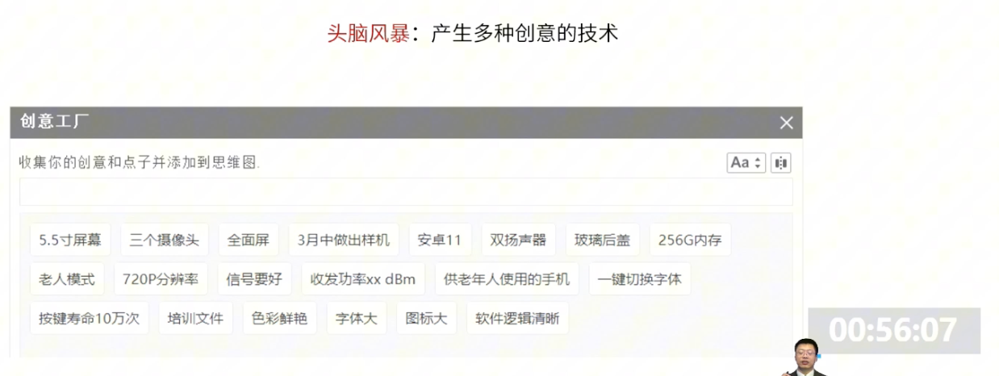
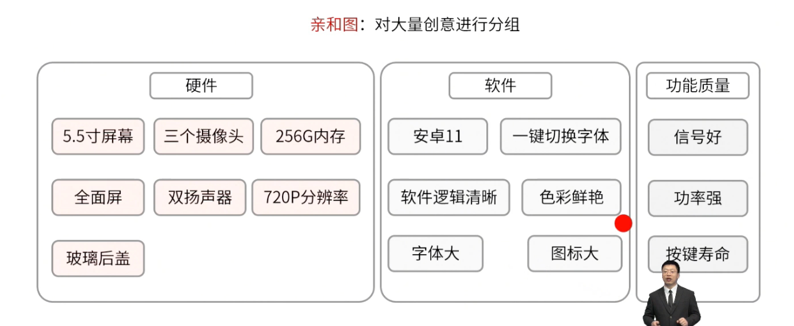
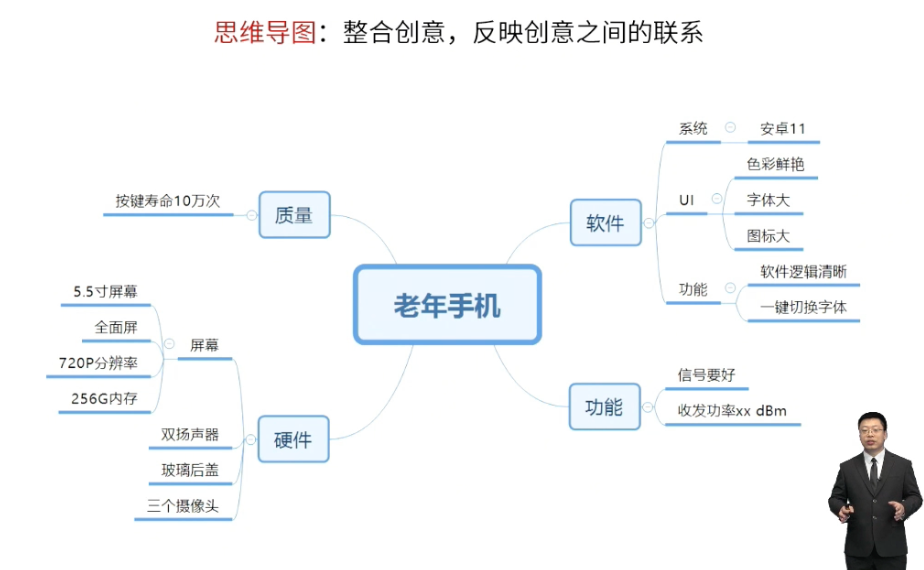
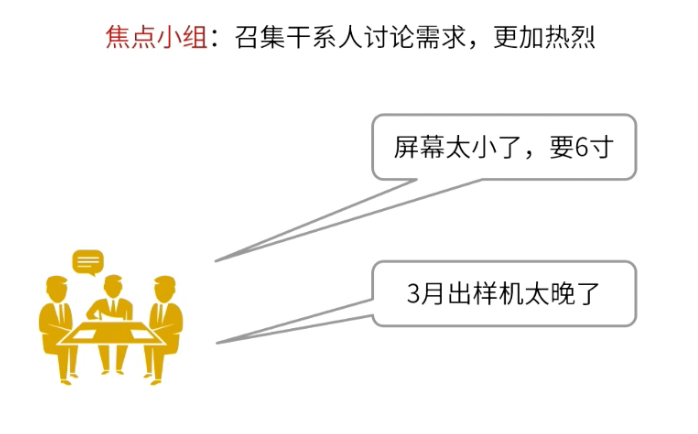
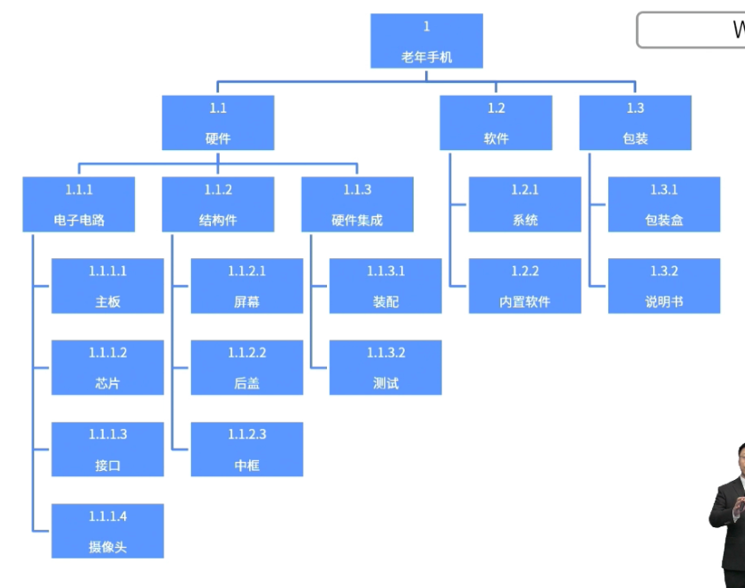

- > 老年手机
- ### [[头脑风暴]]
  logseq.order-list-type:: number
	- 
	- 头脑风暴阶段会把我们提出来的这些所有的需求和创意进行记录。比如说要多大的摄像头？要多大的屏幕？软件应该有什么功能？随便想，随便提。
	- > 一定要注意，千万不要去对别人提出的头脑风暴的内容进行评价。因为一旦评价别人就不愿意说话了，在这个过程中是为了激发大家创意的。疑问要在头脑风暴之后的会议上。
- ### [[亲和图]]
  logseq.order-list-type:: number
	- 
	- 在头脑风暴阶段以后，我们会产生很多需求，对将我们提出的大量的创意进行分类的
- ### [[思维导图]]
  logseq.order-list-type:: number
	- 
	- 在亲和图的基础上进一步加强各个创意（需求）之间的联系
- ### [[焦点小组]]
  logseq.order-list-type:: number
	- 
	- 焦点小组是我们收集完创意以后，我们可以开一个焦点小组会议。召集我们的干系人去讨论需求。
	- > 焦点小组的特点就是讨论的更加热烈
	- 就比如说屏幕太小了啊，我现在要6寸的屏幕啊
	- 然后还有人三月出样机太晚了，希望二月就得出样机。
	- 那么这个也是一个需求的探讨，居于某一个焦点，我们去探讨。所以叫焦点小组
- [[WBS]]
  logseq.order-list-type:: number
	- 