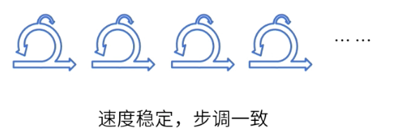

alias:: 敏捷思维模式

- ## 四大价值观
	- ((68350c43-cdd9-4b6a-9162-249eeacd1a99))
	- ((68350c51-5c7a-4d4f-896d-3e23838424d0))
	- ((68350c53-b580-4841-b655-af2cbab52a4b))
	- ((68350c43-1379-4425-ab43-46a892608548))
- ## 十二大原则
	- 我们最重要的目标，是通过持续不断地及早**交付有价值**的软件使客户满意
	  logseq.order-list-type:: number
	  alias:: 交付价值
		- 
		- type:: question
		  collapsed:: true
			- #card 项目经理在打算使用敏捷交付方法的组织中工作，产品负责人问项目经理从项目评估的角度来看敏捷交付的好处是什么。项目经理应该如何回复产品负责人？ {{cloze A}} 
			  A、功能提前交付；因此，更多的价值被交付。
			  B、团队生产力更高；因此，更多的价值被交付。
			  C、成本降低；因此，交付的总价值更高。
			  D、风险显著降低；因此，更多的价值被交付。
	- 欣然面对需求变化，即使在开发后期也一样。 为了客户的竞争优势，敏捷过程**掌握变化**
	  logseq.order-list-type:: number
		- 
	- 经常地交付可工作的软件，相隔几星期或一两个月，倾向于采取较**短的周期**
	  logseq.order-list-type:: number
		- 
	- 业务人员和开发人员必须**相互合作**，项目中的每一天都不例外。
	  logseq.order-list-type:: number
		- 
		  collapsed:: true
			- [[draws/2025-05-27-09-11-39.excalidraw]]
	- 激发个体的斗志，以他们为核心搭建项目。提供所需的环境和支援，辅以信任，从而达成目标。
	  logseq.order-list-type:: number
		- > 激发和信任[[教练]]
	- 不论团队内外，传递信息效果最好效率最高的方式是**面对面的交谈**。
	  logseq.order-list-type:: number
	- **可工作的软件**是进度的首要度量标准。
	  logseq.order-list-type:: number
		- > 可交付物增量
	- 敏捷过程倡导**可持续开发**。责任人、开发人员和用户要能够共同维持步调稳定延续。
	  logseq.order-list-type:: number
		- 
	- 坚持不懈地追求**技术卓越**和良好设计，敏捷能力由此增强。
	  logseq.order-list-type:: number
		- > 技术卓越
	- 以**简洁**为本，它是极力减少不必要工作量的艺术。
	  logseq.order-list-type:: number
		- > [[MVP]] [[最小可行产品]]
	- 最好的架构、需求和设计出自**自组织团队**。
	  logseq.order-list-type:: number
		- > **跨职能团队**
		  成员轮换着发挥领导作用
		  拥有项目的所有资源
	- 团队定期地反思如何能提高成效，并依此调整自身举止表现。
	  logseq.order-list-type:: number
		- > 回顾总结会
		  总结一改进一计划
- ## 实践
-