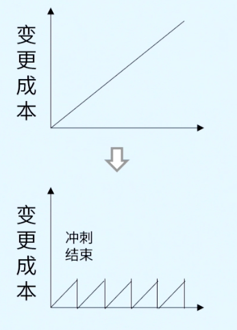

- 2001年2月11日，17位软件工程师，美国犹他州瓦萨奇山雪鸟滑雪场
- 我们一直在实践中探寻更好的软件开发方法，身体力行的同时也帮助他人。由此我们建立了如下价值观：
	- **个体和互动**高于 流程和工具
	  id:: 68350c43-cdd9-4b6a-9162-249eeacd1a99
		- > 研究表明，当个体和互动得到正确对待时，工作绩效可以提高50倍。让开发团队集中办公，并配备一名经过授权的产品负责人
	- **工作的软件**高于 详尽的文档
	  id:: 68350c51-5c7a-4d4f-896d-3e23838424d0
		- > 文档勉强够用即可，可以写文档的场景：
		  1. 交付文档（用户指南）
		  2. 重要的決议
		  3. 高价值（帮助新人）
		  4. 合规性文档
	- **客户合作**高于 合同谈判
	  id:: 68350c53-b580-4841-b655-af2cbab52a4b
		- > 不限制范围变更
		  邀请客户参加敏捷实践
		  指导客户
	- **响应变化**高于 遵循计划
	  id:: 68350c43-1379-4425-ab43-46a892608548
		- 
- 也就是说，尽管右项有其价值， 我们更重视左项的价值。