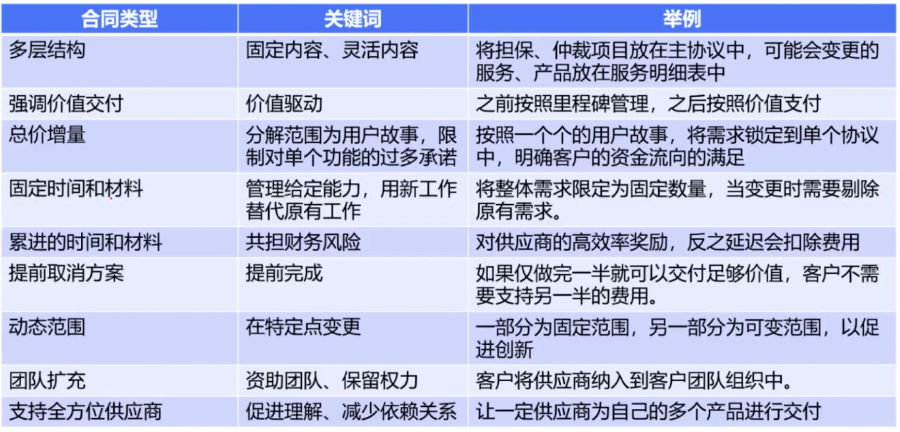

## 敏捷的范围变更
	- 冲刺内不变，冲刺外变更，不允许镀金
	- {:height 239, :width 427}
- ## 敏捷的质量管理
	- 
- ## 敏捷的沟通管理
	- 
- ## 敏捷合同管理
	- 
	- 
	- 
	- 
- ## 指导干系人
	- 指导干系人相关的敏捷实践
	- 避免干系人对团队产生干扰
	- 管理干系人对变革的抵制
- ## 敏捷风险管理
	- 从本质上讲，越是变化的环境就存在越多的不确定性和风险。要应对快速变化，就需要采用适应型方法管理项目， 即：**通过跨职能项目团队和经常审查增量式工作产品**，来加快知识分享，确保对风险的认知和管理。在选择每个迭代期的工作内容时，应该考虑风险；在**每个迭代期间**应该识别、分析和管理风险。
	- **团队协作、频繁审查、每个冲刺**