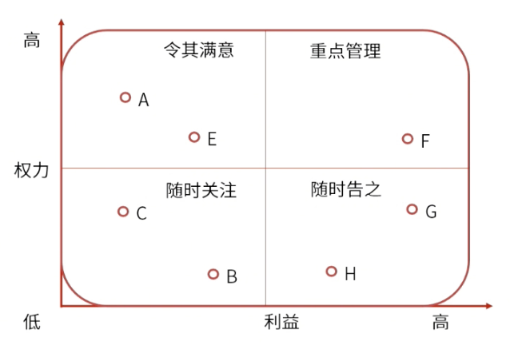

alias:: 权利-影响方格,权利利益水平分类

- #重点 #记忆点 #NoAsk
- 重点管理-紧密关注
- 随时关注-监督
- 随时告知-令其悉知
- 
- type:: question
  collapsed:: true
	- #card 由于全球金融条件恶劣，一家外部金融机构在项目执行阶段成为新的关键干系人，项目经理应该如何与该干系人进行互动？ {{cloze C}}
	  A.令其满意
	  B.监督
	  C.重点管理
	  D. 随时告知
	- #card 一名积极参与产品规划的主管要求全部的可交付成果提高产量，该主管的权力利益水平分类是哪一项？
	  id:: 68407529-64b9-4f6e-9e12-c36db563fbe8
	   A：监督
	   B：令其满意
	   C：紧密关注
	   D：令其知悉
		- 正确答案：C
		  解析：积极参与的主管，权力高利益高，因此要重点管理