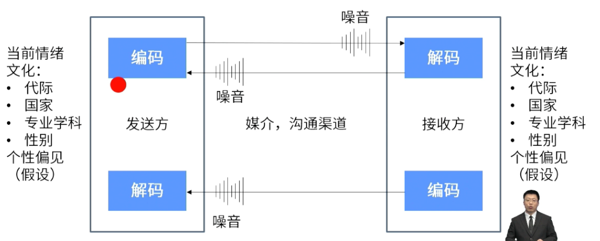

- #重点
- 
- ## 沟通问题
	- 信息发出者表达不清：“黄龙江一派全都带蓝牙”
	- 信息传递路径出问题：“PMP® PASS的邮件被拦截到垃圾邮箱”
	- 信息接收者的理解不清：“马什么梅？”
	- 信息接收者不愿意倾听：“什么档次，给我发信息。”
- # 沟通责任
	- ## 发送方
		- 负责信息的传递，确保信息的清晰性和完整性，并确认信息已被正确理解；
	- ## 接收方
		- 负责确保完整地接收信息，正确地理解信息，并需要告知已收到或作出适当的回应。