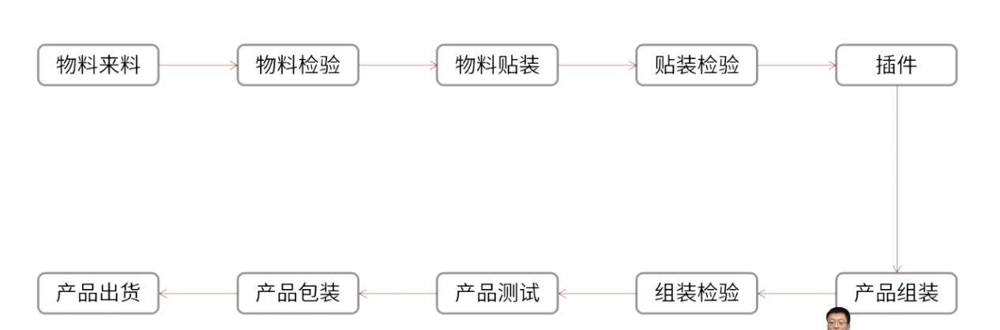

- 展示一系列的流程，引发缺陷的步骤，确认关键质量控制点
- 
- #Question
	- #card 项目经理负责一个IOT项目，项目的目标是开发公司首款智能家居产品。在开发的过程中，项目经理发现整个开发团队对硬件产品的制造过程不熟悉，生产硬件需要经过哪些流程总是需要向专家求助。以下哪一种工具能够解决此问题？
	  A：实验设计
	  B：流程图
	  C：控制图
	  D：帕累托图
		- 正确答案：B
		  解析：绘制一份生产制造流程图，即可解决项目经理的困扰。