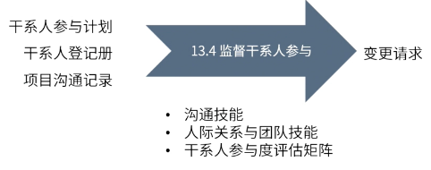

type:: ITTO
chapter:: 13.4

- 
- 监督干系人的参与度，必要时修订参与策略和计划来引导干系人合理参与项目。
- # 过程
	- ## 输入
		- [[干系人参与计划]]
		- [[干系人登记册]]
		- [[项目沟通记录]]
	- ## 工具与技术
		- [[沟通技能]]
		- [[人际关系与团队技能]]
		- [[干系人参与度评估矩阵]]
	- ## 输出
		- [[变更请求]]
- #Question
	- #card 在新项目启动期间，因为项目需要采购新设备，生产经理拒绝接受批准的章程。项目经理通知项目发起人，由于生产经理缺席，章程未能包括设备采购。项目经理下一步应该怎么做？
	  During the start of the new project, the production manager refuses to accept the approved Charter because the project would require the procurement of new equipment. The project manager informs the project sponsor that the Charter fails to include equipment procurement due to the absence of the production manager. What should the project manager do next?
	  A：与客户一起审查生产经理关切的问题 To review the concerns of the production manager with customer
	  B：记录生产经理关切的问题，并在项目开工大会之后获得他们的支持 To record the concerns of the production manager and get their support after the project kick-off meeting
	  C：开展另一项成本效益分析，包括生产经理的反馈 To conduct another cost-benefit analysis, including feedback from the production managers
	  D：向生产经理解释设备成本不会影响项目业务价值 Explain to the production manager that equipment costs will not affect the business value of the project
		- 正确答案：B
		  解析：过程组：实践指南 页码：P337 监督干系人参与：监督项目干系人关系，并通过修订参与策略和计划来引导干系人合理参与项目的过程。 干系人抵制项目，使用干系人的管理方法来进行管理。