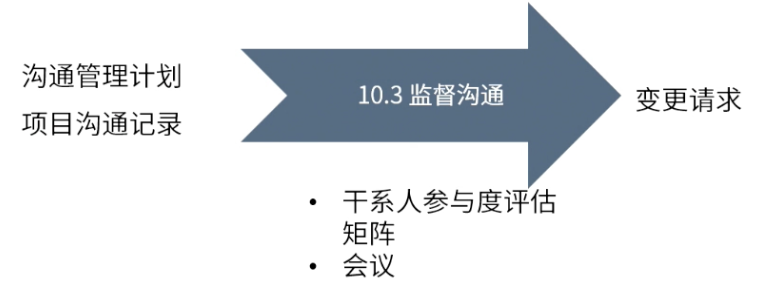

type:: ITTO
chapter:: 10.3

- {:height 201, :width 503}
- 对比沟通管理计划与项目沟通记录，监督沟通是否按照计划执行，若未按计划执行，可能要走变更流程。
- # 输入
	- [[沟通管理计划]]
	- [[项目沟通记录]]
- # 工具与技术
	- [[干系人参与度评估]]
	- [[矩阵]]
	- [[会议]]
- # 输出
	- [[变更请求]]
	-