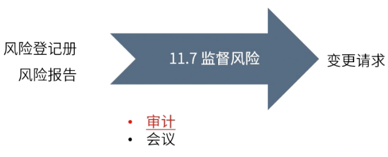
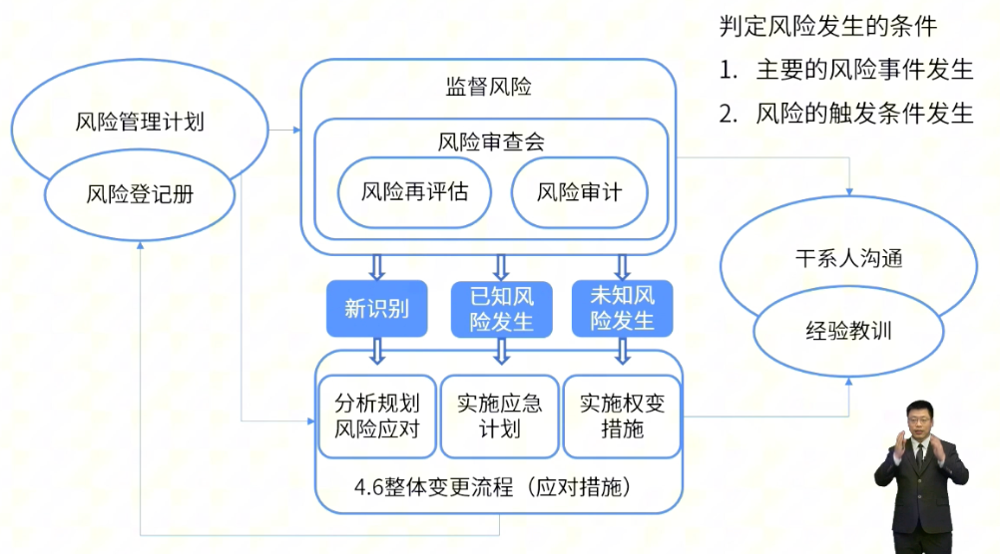

type:: ITTO
chapter:: 11.7

- 
- 通过风险的审查与审计监督风险，确保识别新风险，关闭过时风险， 更新储备，同时对已发生的风险采取措施。
- # 过程
	- ## 输入
		- [[风险登记册]]
		- [[风险报告]]
	- ## 工具与技术
		- [[风险审计]]
		- [[风险审查会议]]
	- ## 输出
		- [[变更请求]]
- # 流程
	- 
- #Question
	- #card 一个组织正在着手部署一个新的数字解决方案，它将彻底改变采购服务。项目经理已经制定了所有必要的计划和活动，以确保成功的整合和解决方案的推出。有一个合作伙伴的系统不可用的风险，这可能会对项目产生负面影响。为了确保项目的成功，需要什么关键活动？An organization is setting out to deploy a new digital solution that will revolutionize procurement services. The project manager has developed all the necessary plans and activities to ensure a successful integration and solution rollout. There is a risk of a partner's system being unavailable, which could negatively impact the project. What key activities are required to ensure the success of the project?
	  A：持续监测合作伙伴系统不可用的风险，并制定适当的解决计划，以防风险变成实际问题。Continuously monitor the risk of partner system unavailability and develop an appropriate resolution plan before the risk becomes a real problem.
	  B：告知项目干系人，完全的整合可能是不可能的，项目将有可能因此而被推迟。Inform project stakeholders that full integration may not be possible and the project will likely be delayed as a result.
	  C：通过授权合作伙伴改变系统设置来消除风险，使其更容易与新的解决方案整合。Eliminate risk by empowering partners to change system settings, making it easier to integrate with new solutions.
	  D：通过制定替代计划来减轻风险，使解决方案在没有完全整合能力的情况下准备就绪并可用。Mitigate risk by developing alternative plans to make solutions ready and usable without full integration capabilities.
		- 正确答案：A
		  解析：过程组：实践指南，P186，7.10-监督风险。项目自启动开始就无法摆脱风险的干扰（假设条件的存在），因此若想对风险进行干预，就需要去了解风险，基于对风险的了解，创建应急计划，达到触发条件了，执行计划对风险进行干预，选项A正确。选项B，虽然风险与项目相伴，但这并不是推迟的理由。选项CD，是采用规避还是采用减轻的策略来对风险进行应对，要基于对风险的评估分析。