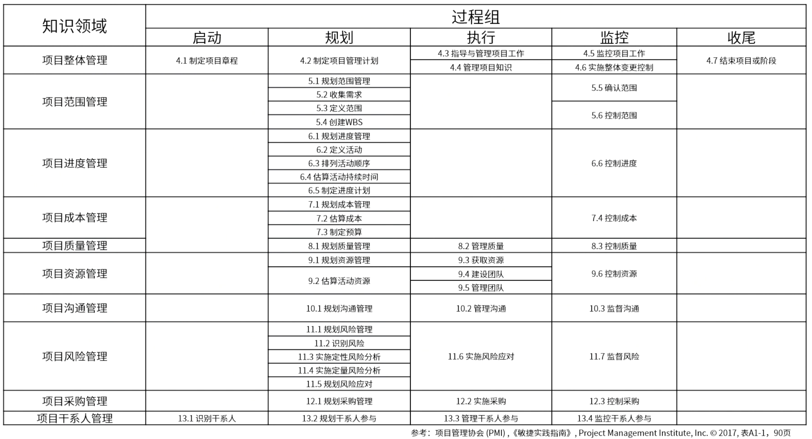

- {:height 684, :width 1248}
  #记忆点
- # 三大基准
	- 范围基准
	- 进度基准
	- 成本绩效基准
- # 五大过程
	- 启动过程组
	- 规划过程组
	- 执行过程组
	- 监控过程组
	- 收尾过程组
- # [[十大知识领域]]
	- [[项目整合管理]]
	- [[项目范围管理]]
	- [[项目进度管理]]
	- [[项目成本管理]]
	- [[项目质量管理]]
	- [[项目资源管理]]
	- [[项目沟通管理]]
	- [[项目风险管理]]
	- [[项目采购管理]]
	- [[项目相关方管理]]