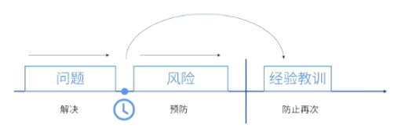

alias:: Lessons Learned Register

- # 定义
	- 用于记录在项目中所获知识的项目文件，它用于当前，并列入经验教训知识库。
	- > 记录遇到的挑战、问题、意识到的风险和机会在项目早期创建，在整个项目中不断更新经验教训登记册纳入[[组织过程资产]]。
- > 需要注意区分问题、风险和经验的三个文件。
  
- #Question
	- #card 产品设计被认为是各种制造问题的根本原因，若要在将来避免面对同样的问题，项目经理应该怎么做？
	   A：执行实施质量保证过程
	   B：审查过程改进计划
	   C：执行实施整体变更控制过程
	   D：更新经验教训知识库
		- 正确答案：D
		  解析：经验教训主要是着眼未来，改善未来的项目绩效，让未来的项目不会在同一个地方重复出现问题
	- #card 一个项目成员完成了所有分配的项目任务，该资源的经理请求立即将资源调到另一个项目上工作，项目经理下一步应该怎么做？
	   A：完成该资源在项目上的绩效评估
	   B：评估该资源对另一个项目阶段是否有帮助
	   C：建议该经理将其他资源调到另一个项目上
	   D：要求该资源记录项目过程的经验教训
		- 正确答案：D
		  解析：该成员已经完成工作，需要他留下经验教训，不选A的原因就是[[绩效评估]]是在过程中评估，而非完成的时候才评估。