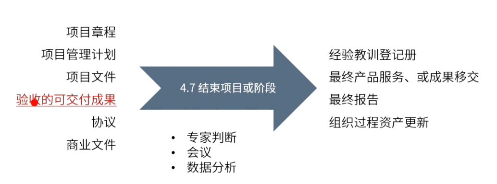

type:: ITTO
chapter:: 4.7

- 
- # 过程
	- ## 输入
		- [[项目章程]]
		- [[项目管理计划]]
		- [[项目文件]]
		- [[验收的可交付成果]]
		- [[协议]]
		- [[商业文件]]
	- ## 工具与技术
		- [[专家判断]]
		- [[会议]]
		- [[数据分析]]
	- ## 输出
		- [[经验教训登记册]]
		- 最终产品服务、或成果移交
		- 最终报告
		- [[组织过程资产]]
- #Question
	- #card 一个研究和开发团队正在完成一项为期两年的项目。项目经理专注于项目的结束活动。哪项活动应该被视为优先事项？A research and development team is completing a two-year project. Project managers focus on the closing activities of the project. Which activity should be considered a priority?
	  collapsed:: true
	  A：释放资源并计划一个项目完成的庆祝活动。Free up resources and plan a celebration of project completion.
	  B：召开指导委员会会议，通知他们项目的状态。Hold a steering committee meeting to inform them of the status of the project.
	  C：确保知识转移活动按计划执行。Ensure that knowledge transfer activities are carried out as planned.
	  D：标记产品待办事项列表的完成状态，并更新沟通管理计划。 Mark the completion status of the product backlog and update the communication management plan.
		- 正确答案：C
		  解析：过程组：实践指南，P198,结束项目或阶段-行政收尾。在结束项目时，项目经理需要确保所有项目工作都已完成以及项目目标均已实现。A和C都属于收尾流程标准动作，但是应该先进行知识转移，最后再释放资源，因此选项C正确。选项B，在结束项目时，需要报告的不只是项目的状态，而是包含了项目总绩效的最终报告，B不选；选项D是项目进行中的活动，不属于收尾动作，不选。