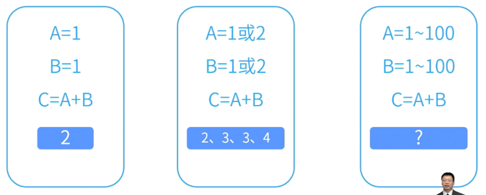
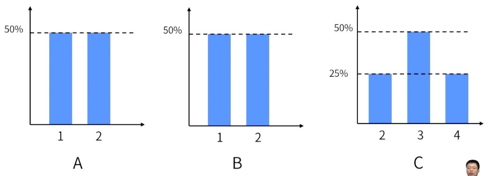
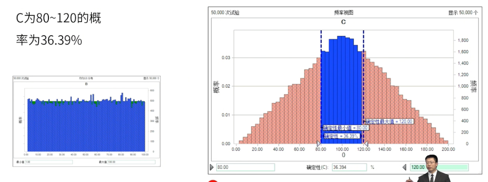
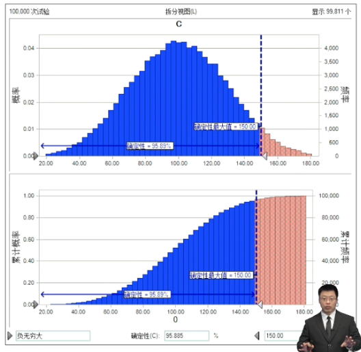

alias:: 模拟,蒙特卡洛模拟,S曲线

- #重点 #NoAsk
- 蒙特卡洛分析是一种基于概率统计的数值计算方法，通过大量的随机抽样来估计一个系统可能的行为或结果。
- # 蒙特卡洛分析原理
	- 首先确定哪些变量是不确定的，并且这些变量的不确定性对项目结果有显著影响。然后，为每个不确定性变量设定一个合适的概率分布，并使用随机数生成器从每个变量的概率分布中抽取样本值。将这些样本值代入项目模型中，计算项目结果，并重复多次模拟。最后，收集所有模拟计算的结果，进行统计分析，得到项目结果的概率分布。
	- 
	- 
	- 
- # 蒙特卡洛分析应用
	- **风险评估：**项目经理可以使用蒙特卡洛分析来估计项目风险的可能性和影响。通过对历史数据进行分析，预测未来项目可能面临的风险及其概率，从而提前采取相应的预防措施。
	- **制定预算：**蒙特卡洛分析可以帮助项目经理更准确地预测项目成本。通过对项目中各项活动的成本进行模拟分析，可以得出一个更加贴近实际的预算估计。
	- **预测项目进度：**蒙特卡洛分析还可以用于预测项目的完成时间。通过对项目中各项活动的持续时间进行模拟分析，可以得
- > **假如，活动A和B都是1万到 100万内符合三角分布的成本。C=A+B，请问花150万完成项目的概率是多少？**
  经过10万次的数据试验，得出C基本满足贝塔分布，150 万内完成的概率是95.89%。
  右图为S曲线。
  
- #Question
	- #card 项目经理要求风险经理开展每月的定量风险分析。风险经理应该提交什么？ {{cloze A}}
	  A.蒙特卡洛累积图
	  B.风险重新评估
	  C.概率和影响矩阵 
	  D.根据概率和影响等级来识别风险