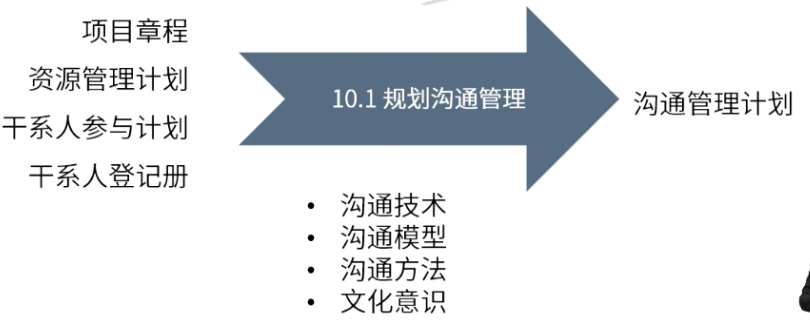

type:: ITTO
chapter:: 10.1

- 
- 基于团队与干系人沟通需求，制定沟通管理计划，以确定把什么信息在什么时间以什么方式传递给什么人。
- # 输入
	- [[项目章程]]
	- [[资源管理计划]]
	- [[干系人参与计划]]
	- [[干系人登记册]]
- # 工具与技术
	- [[沟通技术]]
	- [[沟通模型]]
	- [[沟通方法]]
	- [[文化意识]]
- # 输出
	- [[沟通管理计划]]