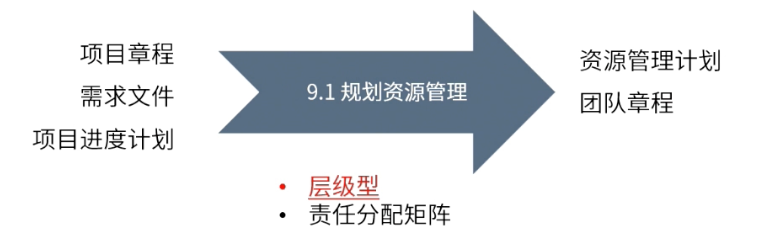

type:: ITTO
chapter:: 9.1

- 
- 基于项目章程、项目管理计划以及进度需求，将资源进行一系列的规划，明确角色与职责，最终输出资源管理计划与团队章程的过程。
- # 输入
	- [[项目章程]]
	- [[需求文件]]
	- [[项目进度计划]]
- # 工具与技术
	- [[层级型]]
	- [[责任分配矩阵]]
- ## 输出
	- [[资源管理计划]]
	- [[团队章程]]