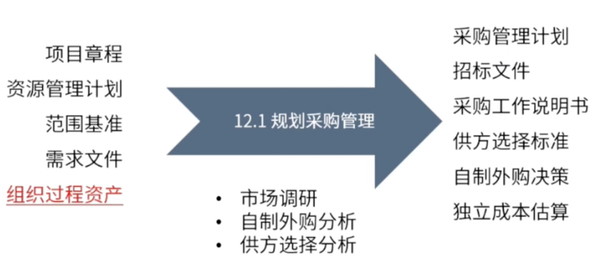

type:: ITTO
chapter:: 12.1

- 
-
- # 过程
	- ## 输入
		- 项目章程
		- 资源管理计划
		- 范围基准需求文件
		- 组织过程资产
			- [[合同类型]]
	- ## 工具与技术
		- 市场调研
		- [[自制外购分析]]
		- 供方选择分析
	- ## 输出
		- 采购管理计划
		- 招标文件
		- [[采购工作说明书]]
		- [[供方选择标准]]
		- [[自制外购决策]]
		- [[独立成本估算]]
-