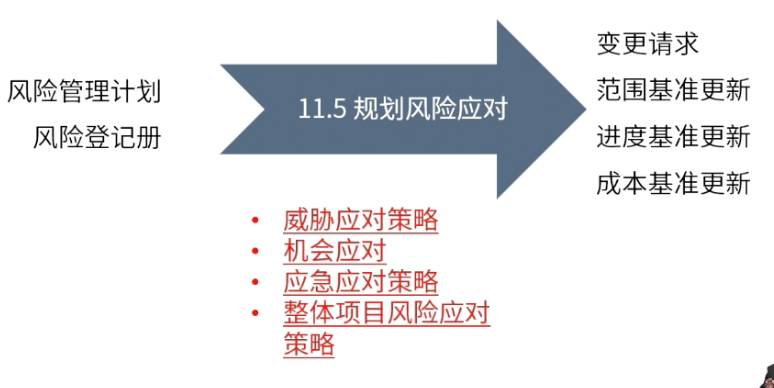

type:: ITTO
chapter:: 11.5

- 
- 针对已经识别的高优先级的风险制定风险应对策略，以减小风险敞口。
- # 过程
	- ## 输入
		- [[风险管理计划]]
		- [[风险登记册]]
	- ## 工具与技术
		- > 以下工具均属于[[风险应对策略]]
		- 威胁应对策略
		- 机会应对
		- 应急应对策略
		- 整体项目风险应对策略
	- ## 输出
		- [[变更请求]]
		- [[范围基准更新]]
		- [[进度基准更新]]
		- [[成本基准更新]]