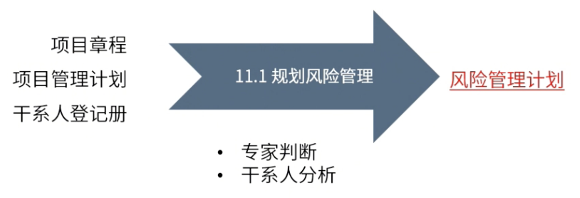

type:: ITTO
chapter:: 11.1

- 
- 对项目章程与干系人进行分析，确定其风险的接受程度，制定风险管理计划，以确立风险的临界值以及整体的管理方法论。
- # 过程
	- ## 输入
		- [[项目章程]]
		- [[项目管理计划]]
		- [[干系人登记册]]
	- ## 工具与技术
		- [[专家判断]]
		- [[干系人分析]]
	- ## 输出
		- [[风险管理计划]]
-