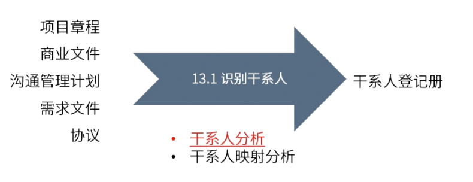

type:: ITTO
chapter:: 13.1

- 
- 从商业文件、项目启动文件、沟通文件、需求文件与合同文件中识别项目的干系人，并进行干系人的分析及排序，记录到干系人登记册中。
- # 过程
	- ## 输入
		- [[项目章程]]
		- [[商业文件]]
		- [[沟通管理计划]]
		- [[需求文件]]
		- [[协议]]
	- ## 工具与技术
		- [[干系人分析]]
		- [[干系人映射分析]]
	- ## 输出
		- [[干系人登记册]]