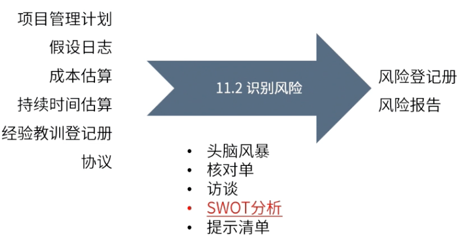

type:: ITTO
chapter:: 11.2

- 
- 基于项目的假设、制约、估算文件、经验教训等文件，使用头脑风暴、 核对单、SWOT分析等工具，对项目的风险进行全方位的识别。
- # 过程
	- ## 输入
		- [[项目管理计划]]
		- [[假设日志]]
		- [[成本估算]]
		- [[持续时间估算]]
		- [[经验教训登记册]]
		- [[协议]]
	- ## 工具与技术
		- [[头脑风暴]]
		- [[核对单]]
		- [[访谈]]
		- [[SWOT分析]]
		- [[提示清单]]
	- ## 输出
		- [[风险登记册]]
			- 已识别的风险清单
			  logseq.order-list-type:: number
			- 潜在的风险责任人
			  logseq.order-list-type:: number
			- 潜在的风险应对措施清单
			  logseq.order-list-type:: number
		- [[风险报告]]
- #Question
	- #card 在项目执行过程中，职能经理识别出一个有关外包团队的新的内部风险。职能经理向项目经理寻求一个不会对项目产生负面影响的快速解决方案。项目经理应该怎么做？
	  A：创建[[风险分解结构]](RBS)
	  B：按照严重级别记录风险
	  C：执行风险策略
	  D：使用变更管理计划
	- 正确答案：B
	  解析：在识别出一个新的内部风险后，将风险记录在风险登记册中。